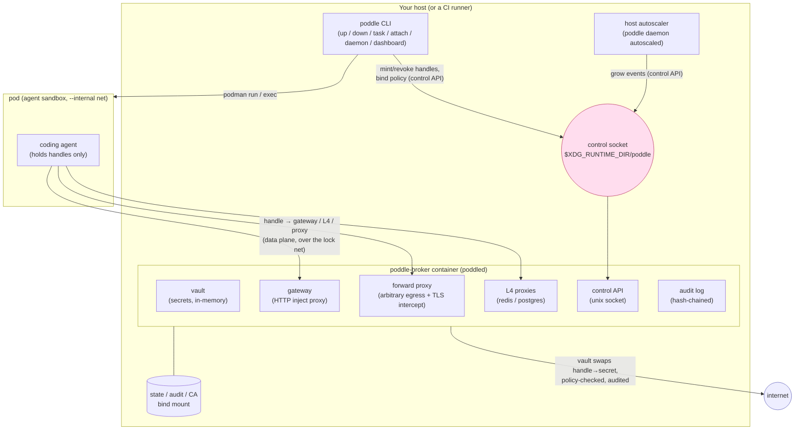
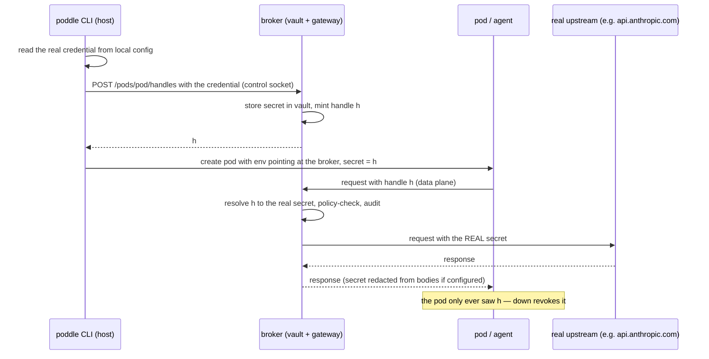
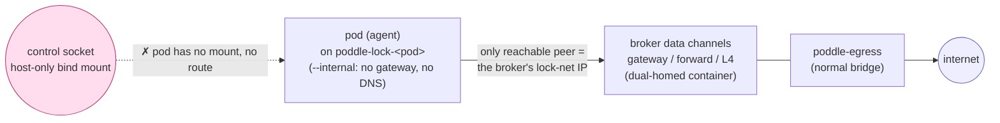
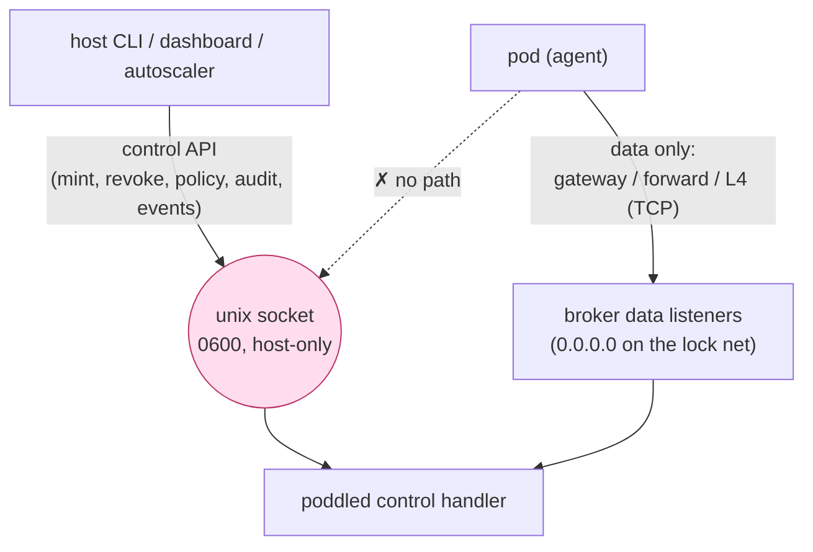
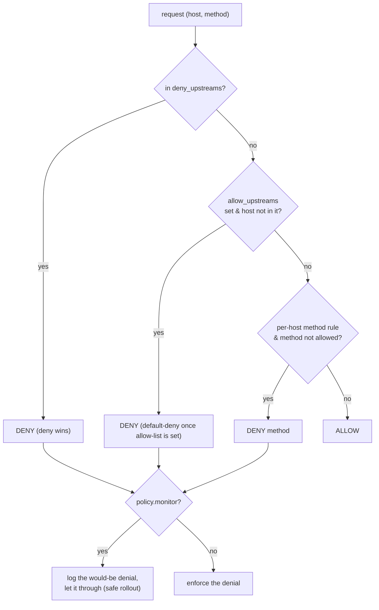
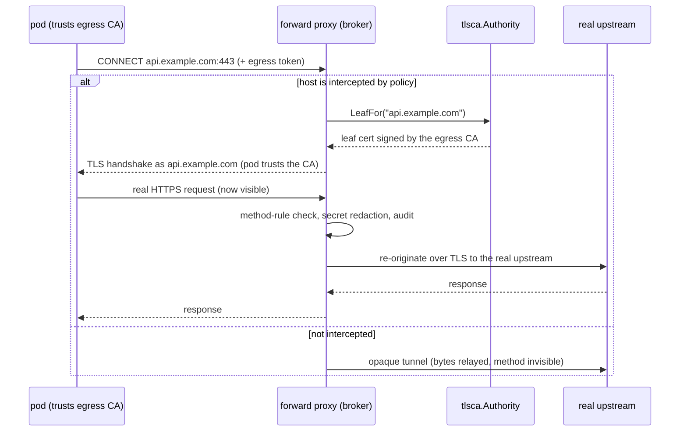

# poddle architecture

> The canonical map of how poddle fits together. Per-subsystem detail lives in
> `docs/design/*`; this document is the overview they hang off. If a diagram here
> and the code disagree, the code wins — please fix the diagram.

## What poddle is

poddle runs a coding agent in a **secretless sandbox**. The agent never holds your
real credentials: a **broker** on your host holds them, the **pod** holds only
opaque, revocable **handles**, and every byte the pod sends out is brokered,
policy-checked, and audited. A prompt-injected or malicious agent can neither read
a secret, reach an un-allowed host, nor change its own governance.

Two promises, enforced (not merely configured):

1. **Secretless.** The pod is issued a handle, never the credential. The broker
   swaps handle → real secret on the wire; the secret never enters the pod.
2. **Non-bypassable egress.** The pod's only route off-box is the broker. It sits
   on an internal (no-internet, no-DNS) network whose sole exit is the broker, so
   there is nowhere else for a packet to go — policy and audit are unavoidable.

---

## Components

- **poddle CLI** — the user-facing binary. `up`/`task` create pods; it talks to
  the broker's control API over a host Unix socket to mint handles and bind
  policies, and drives podman to create the pod. It never proxies pod traffic.
- **poddled (the broker)** — a persistent daemon that now runs as a **single,
  shared, dual-homed container** (`poddle-broker`). It holds the vault and serves
  the data-plane channels + the control API. One per host; it outlives any single
  CLI invocation so detached pods keep working.
- **pod** — the agent's sandbox container, on an `--internal` network. Reaches
  only the broker.
- **host autoscaler** — an opt-in host-side loop (`poddle daemon autoscaled`)
  that grows headless pods under memory pressure; see *Autoscaler* below.

Package map (`src/internal/`): `broker` (vault + gateway + forward proxy),
`poddled` (the daemon wrapper, control API, launch, autoscaler), `podman`
(engine + broker/pod/network lifecycle), `l4` (redis/postgres wire proxies),
`policy` (governance rules + `Decide`), `tlsca` (interception CA), `brokerendpoint`
(placement address resolver), `audit` (tamper-evident log), `connector` /
`identity` / `harness` (what gets wired into a pod), `sandbox` (the pod spec).

---

## The secretless model

The core trick: the agent's tools are pointed at the broker with a **handle** in
place of the credential; the broker resolves the handle to the real secret only
as it re-originates the request upstream.

Three data-plane channels carry this, depending on what the pod needs:

| Channel | For | How the pod uses it |
|---|---|---|
| **gateway** | HTTP APIs with a bearer/token identity (e.g. the Anthropic API) | env points the harness at the gateway; the handle rides in the auth header, the gateway swaps it |
| **forward proxy** | arbitrary HTTP(S) egress (npm, pip, git, fetch) | `HTTP(S)_PROXY` → the broker; governed by policy, optionally TLS-intercepted |
| **L4 redis / postgres** | datastores | the pod connects to the broker's redis/postgres port using the handle as the password; the broker swaps in the real DSN |

Every locked pod gets a forward proxy so *all* arbitrary egress is non-bypassable.
Egress is also **contained by default**: a pod with no explicit policy gets a
*derived* default-deny allow-list — exactly its identity's API host, its
connectors' hosts, and its harness's install/runtime hosts (e.g. the npm
registry) — so the agent works out of the box while it cannot exfiltrate to
unrelated hosts. An explicit policy replaces the derived one. See *Governance*.

---

## Egress lockdown (the network model)

Lockdown is **topological**, not honor-system. The pod joins only its own
`--internal` network; the broker is the single peer on that network with a route
out. Rewriting `HTTP_PROXY` is pointless — there is no other path for a packet.

- The pod's egress **allow-list** is derived from the same `brokerendpoint`
  resolver that hands it its addresses, so the pinhole and the pod's config can
  never drift: the only address the pod is *told* to use is the only one it *can*
  reach.
- **DNS is an egress channel too** — the `--internal` net has no resolver, so the
  broker resolves names for allowed destinations. DNS-tunnel exfiltration closes
  with the rest.
- **Fail-closed is mandatory.** If the egress network, the broker container, the
  pod lock net, the connect, or the broker-IP resolution can't be established,
  `up` refuses to create the pod — never an open-egress fallback.

`up` lifecycle for a brokered pod: ensure `poddle-egress` → ensure the
`poddle-broker` container → create `poddle-lock-<pod>` (`--internal`) → connect
the broker to it → read the broker's IP there → resolve channels + allow-list →
create the pod on the lock net. `down` reverses it (revoke handles → disconnect
broker → remove the lock net); the shared broker and egress net persist.

---

## Control plane vs. data plane

The security boundary. The **control plane** (mint/revoke a handle, bind a policy,
read the vault, query audit) is a Unix socket on a **host-only bind mount**. The
pod gets neither the mount nor a network route to it, so it can never touch
governance — the property holds *by construction*, not by a rule.

Because the broker holds every secret, it also **holds no pod-lifecycle power**:
the container mounts no podman socket. Pod creation/teardown/autoscale run on the
host, not in the broker — a deliberate split (broker = secrets/gateway/audit;
host = lifecycle).

### Privilege separation (opt-in two-process broker)

By default the broker is a single process: the code that parses untrusted pod and
upstream bytes (the gateway, forward proxy, and L4 terminators) shares an address
space with the credential custody (the memguard vault, OAuth refresh tokens, and
the egress-interception CA key). A memory-disclosure bug in a parser could in
principle read that custody.

Setting **`PODDLE_BROKER_PRIVSEP=1`** on the broker splits the two: `poddled` (the
untrusted *front*) forks a **keeper** subprocess over an inherited `AF_UNIX`
socketpair, and the keeper holds the **only** copy of the vault, the refresh
tokens, and the CA private key. The front holds no plaintext credential — only
opaque handles, a non-secret public view of each credential, and a fingerprint of
the injected token — and delegates every secret-touching operation (resolve,
auth-injection, egress redaction, OAuth refresh, the L4 SCRAM proof, and TLS-leaf
signing) to the keeper as a request over the socketpair. So a front RCE can no
longer *dump* the vault; its blast radius shrinks to the access tokens for handles
it can replay, one injection at a time, plus per-host leaves it can ask the keeper
to mint online — never the durable custody itself.

It is **opt-in and default-off** (the same cautious posture as TLS interception):
the shipped single-process broker stays the default until you enable it, and it is
Linux-only (the fork/socketpair mechanism). Fork, `exec`, and the socketpair all
work under the Tier-1 hardened container (`--read-only --cap-drop=all
--no-new-privileges`, distroless static binary) — none of that lockdown blocks
them. The split is **fail-closed**: if the keeper dies, every custody call errors
(so requests fail closed and egress bodies block rather than forward unscanned),
`poddled` exits non-zero, and its supervisor restarts it. Confirm it's active with
`poddle daemon status` (it reports `broker: two-process` when the keeper is running).
Full design and the per-stage record are in
[`design/broker-privilege-separation.md`](./design/broker-privilege-separation.md).

---

## Governance: policies

A policy binds to a pod and the broker enforces it on every brokered request.
`policy.Decide(host, method)` order:

Policy fields (`src/internal/policy`): `allow_upstreams` (default-deny when
non-empty; `.suffix` = subdomains), `deny_upstreams` (always, wins), `methods`
(per-host allowed HTTP methods; `*` key = all hosts), `egress`
(redact | block | off — secret handling in bodies), `monitor` (evaluate but log,
don't block — safe rollout), `intercept` / `intercept_hosts` (TLS interception,
below). A pod with **no** explicit policy is **not** default-allow: `up` binds a
derived **`poddle-default`** policy whose `allow_upstreams` are exactly the pod's
identity API host, its connectors' hosts, and its harness's egress hosts — so it
is contained by default and can't reach unrelated hosts. A nil/unknown egress
token is denied.

---

## TLS interception (opt-in)

HTTP method rules and body redaction are invisible inside an opaque `CONNECT`
tunnel. To enforce them on **HTTPS**, the forward proxy can terminate TLS with a
leaf minted by poddle's own CA, inspect/redact the request, and re-originate to
the real upstream. **Strictly opt-in** (`intercept` / `intercept_hosts` in a
policy); non-intercepting egress stays an opaque tunnel.

- The **CA** (`tlsca`) is long-lived and self-signed; it mints short-lived
  per-host leaves held in a bounded in-memory LRU (re-minted near expiry). The CA
  **cert** is injected into the pod's trust store (`up` mounts it + sets
  `NODE_EXTRA_CA_CERTS`/`SSL_CERT_FILE`/…); the CA **key stays on the broker's
  side** — the pod only ever receives the cert. Under `PODDLE_BROKER_PRIVSEP` the
  CA key and the leaf-signing live entirely in the keeper subprocess (the front
  gets only the per-host leaf it presents), see *Privilege separation* above.
- **Shared CA across the container boundary.** The pod's trusted CA and the
  broker's signing CA must be the *same* CA. The broker **generates and persists**
  it on its bind-mounted state dir (`PODDLE_EGRESS_CA_DIR=/state/egress-ca`), so it
  survives restarts, and `up` reads that same host file (`poddled.EgressCADir()` —
  `/state`'s mount source) to inject the cert. `up`'s `EnsureRunning` waits for the
  broker to be healthy before reading, so the broker is the sole generator and
  there is no race. This replaces the old `UserConfigDir` resolution, which
  diverged across the host↔container boundary (pod trusted a different CA than the
  broker signed with). Proven end-to-end by `e2e-intercept`.

---

## Broker placement

Everything is one sentence — *the pod holds a handle and points at a broker* — so
**where the broker runs is a resolver** (`brokerendpoint.Endpoint`), not a
hardcoded address. It yields each channel's pod-facing address and the exact
allow-list.

| Placement | Broker runs on | Pod reaches it via | Status |
|---|---|---|---|
| **colocated** | the pod's own host (dual-homed container) | its peer IP on the pod's internal net | **shipped** |
| **direct** | a routable trusted host (VPS / cloud) | its address, over TLS | roadmap |
| **tunnel** | your laptop / NAT'd box | reverse SSH (`ssh -R`) | roadmap (the original "remote pods" goal) |

See `docs/design/egress-lockdown-and-broker-placement.md` for the placement
build-order and the remote-pod steps.

### Local (loopback) upstreams

A credential can point at a service on the developer's own machine — a local
Postgres at `127.0.0.1:5432`, a Redis at `localhost:6379`, or a local HTTP API.
Because the colocated broker runs **inside a container**, a bare `127.0.0.1`
would resolve to the broker container's *own* (empty) loopback, not the host's.

So the containerized broker is launched with
`PODDLE_LOOPBACK_HOST=host.containers.internal`, and it rewrites a **loopback**
upstream (`localhost`, `127.0.0.0/8`, `::1`) to that host route **at dial time**,
preserving the port. The rewrite is applied on the L4 (redis/postgres), gateway,
and forward-proxy plain/CONNECT paths (`broker.RewriteLoopbackHost`). Two
properties are deliberate:

- It runs *after* the policy check and keeps the upstream `Host` header, so
  governance and audit still see the pod-configured host — only the packet's
  destination changes.
- It does **not** widen egress. Configured local upstreams already enter the
  derived default-deny allow-list; a pod that *spontaneously* reaches for
  `localhost` still needs an explicit allow-list entry. The rewrite fixes the
  reachability mechanism, never the policy.

A bare-host (non-container) broker leaves `PODDLE_LOOPBACK_HOST` unset, where
loopback already means the host, so no rewrite happens.

---

## Autoscaler

Opt-in (`--autoscale`). A **host-side** loop (`poddle daemon autoscaled`, spawned
by `up`/`task`, single-instance via an flock lock) reads live pod memory from host
podman and grows a sustained-pressure *headless* pod one size tier with
`poddle move` (interactive pods are warned, never moved). Its grow/warn events are
pushed to the broker's control API so `daemon status` and the audit log surface
them. It runs on the host — not in the broker container, which has no podman.
Detail: `docs/design/reactive-autoscale.md`.

---

## Audit

Every brokered request, redaction, block, handle/pod lifecycle event, and
autoscale action is appended to a **tamper-evident, hash-chained** log
(`src/internal/audit`), queryable/streamable via the control API and surfaced by
`poddle daemon audit` and the dashboard. The chain verifies end-to-end; a deleted
or altered row is detectable. Secrets are never written to it. Detail:
`docs/design/governance-audit.md`.

---

## Packaging & lifecycle

- The broker runs from a published image, `ghcr.io/datadir-lab/poddle-broker`,
  built from `Containerfile.broker` (a static poddle binary on a distroless base).
  `EnsureRunning` resolves the ref to the CLI's own version
  (`:<version>`, `dev` → `:latest`); `PODDLE_BROKER_IMAGE` overrides it (CI/e2e
  point at a locally-built image). Published by `publish-broker.yml` (on release,
  or on-demand). The image must be **public** for an unauthenticated `poddle up`
  to pull it.
- One shared broker container per host is the singleton (single vault, single
  audit writer); it is started on first `up`, restarted if stopped, and reused.

---

## Known gaps / status

Living list of where the code and the intended architecture above differ. Keep it
short; close items, don't let them rot.

- **`poddle-broker` image visibility.** The image is published but private; an
  unauthenticated `poddle up` can't pull it until the package is made public.
- **Broker privilege separation (custody vs. parsing) — shipped, opt-in.** All
  three tiers have landed: Tier 0 (fuzz the redactor + proxy-auth parser, enforce
  the no-secret-egress invariant), Tier 1 (broker container `--cap-drop=all`,
  `no-new-privileges`, read-only rootfs), and Tier 2 — the OpenSSH-style split of
  custody from parsing into a keeper subprocess, enabled with
  `PODDLE_BROKER_PRIVSEP=1` (see *Privilege separation* above). Tier 2 is **opt-in
  and default-off**: the single-process broker remains the shipped default, so this
  is no longer a gap in the default posture but a hardening operators can turn on.
  Design and the per-stage record are in
  [`design/broker-privilege-separation.md`](./design/broker-privilege-separation.md).
- **Single-broker blast radius (by design).** One shared broker per host holds
  every pod's vault and audit chain, so a full vault compromise reaches all
  co-located pods. This is a deliberate MVP trade-off (one surface to harden, one
  audit chain); pods stay secretless and the control plane owner-only, which
  bounds it. Per-tenant isolation is a poddle-cloud roadmap item, not an OSS
  single-host change — see
  [`design/broker-isolation-and-blast-radius.md`](./design/broker-isolation-and-blast-radius.md).
